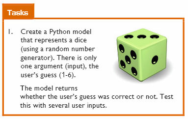

# Basic Dice Model 🎲

Complete the following tasks:

### Part A 
- Create two functions called `roll_dice` and `check_guess`.
- Using these functions, complete what is asked in the question above:
  - Generate a random number that represents the dice roll.
  - Check the user's guess against the randomly generated dice roll.
  

### Part B
- For the second part of the question, create a list of test values called `user_inputs[]` and populate this with _valid_ and _invalid_ user guesses.
- Use a `for` loop to iterate through this test list.
- See if your program operates as expected 👀

  